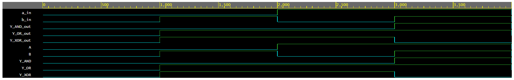

# Simple VHDL example of AND, OR and XOR gates design and testbench.

## Configuration

```yml
Language: VHDL
Top entity: testbench
Simulator: Aldec Riviera Pro 2025.04
Output: Open EPWave after run
```

## Output Screenshot

