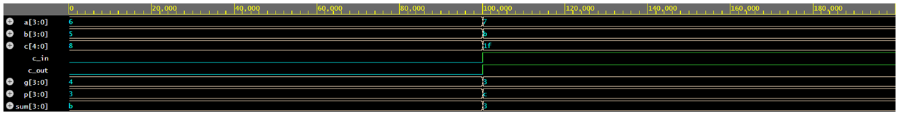

# Implementation of 8-bit Adder using Carry Look Ahead Adder

## Configuration

```yml
Language: VHDL
Top entity: testbench
Simulator: Aldec Riviera Pro 2025.04
Output: Open EPWave after run
```

## Output Screenshot

